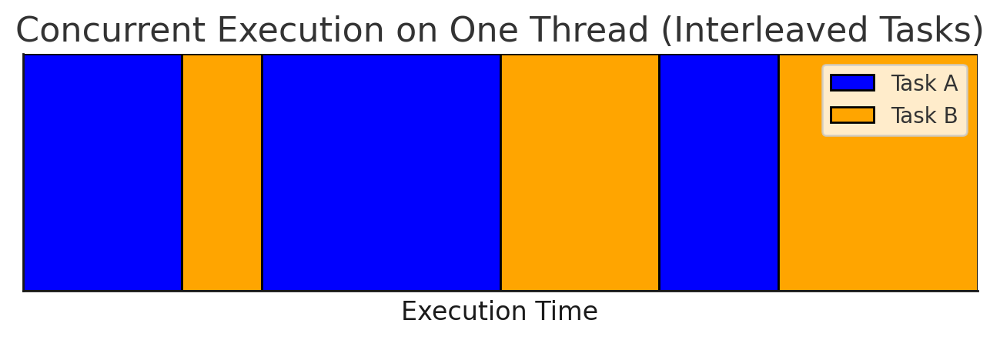

# The Pitfalls of Async Python
Async Python is great - until you get to the point where it's not.
And when it fails, it fails hard.
One **accidental blocking call** is all it takes to freeze your entire application.

## Accidental Blocking Call
> It's easy to inadvertently introduce blocking calls into async code, which can freeze your entire application.

We often rely on third-party libraries,
but we can't vouch for every single one of them, assuming they're truly async-safe.
I learned this the hard way when a poorly written library caused a nightmare production issue.
I spent a week on debugging why my FastAPI server, which relied on async endpoints, suddenly became unstable.

Unbeknownst to me, one of the libraries I used had a hidden flaw:
when a database connection dropped, it would block the coroutine for an extended period,
effectively freezing the entire async loop.

The worst part is that when the app locks up like that, it becomes completely unresponsive.
No logs, no errors - just silence.
You can't even see what's going on or check where it's stuck because it's not responding!
Even health checks stop working, triggering endless restarts in Kubernetes.
Debugging was a nightmare. Once you experience this, you'll never look at async Python the same way again.
That's why I avoid async Python whenever I can.

## Coroutine Timeout
Here's a surprising example.
Imagine using a poorly written library that blocks a coroutine for a long time like this:
```python
async def cant_stop_me():
    time.sleep(10)  # Should use: await asyncio.sleep(10)
```

To protect from a deadlock,
you might try using this seemingly promising
[`asyncio.timeout`](https://docs.python.org/3/library/asyncio-task.html#asyncio.timeout):
```python
import asyncio
import time

async def cant_stop_me():
    time.sleep(10)

async def main():
    async with asyncio.timeout(1):
        await cant_stop_me()

asyncio.run(main())
```

Wrong! The function still runs for 10 seconds, ignoring the timeout.


Why? Because `time.sleep(10)` is a blocking call. Once Python hands control to a coroutine,
it won't return to the event loop until the coroutine willingly yields control.
Since it never does, the timeout mechanism is powerless.

This sounds silly as you think about it:
to interrupt the **unresponsive** coroutine, the async loop first waits until it becomes **responsive**.

If you call something synchronous in an async thread, it will block, and there's nothing you can do.
Any kind of cancelling the coroutine won't work here,
because in asyncio there's only one thread, and this single thread is now fully occupied by the busy coroutine.
So Python kindly waits until the naughty coroutine let go of the control. It's hopeless.

A proper solution is to offload blocking calls to a **separate thread** using
[`asyncio.to_thread`](https://docs.python.org/3/library/asyncio-task.html#asyncio.to_thread)
and await it asynchronously, preventing the main async loop from being blocked:
```python
import asyncio
import time

def cant_stop_me():
    time.sleep(10)

async def main():
    try:
        async with asyncio.timeout(1):
            await asyncio.to_thread(cant_stop_me)
    except TimeoutError:
        print('Timeout')

asyncio.run(main())
```
Now it works as expected: the main thread remains free, and the timeout functions properly.
However, the blocking operation still runs in the background thread,
it just no longer disrupts the event loop.

## Cancelling Coroutine
You might think [`asyncio.Task.cancel`](https://docs.python.org/3/library/asyncio-task.html#asyncio.Task.cancel)
is a reliable way to terminate coroutines. Unfortunately, that doesn't always work either.
```python
import asyncio
import time

async def cancel_me():
    time.sleep(10)

async def main():
    task = asyncio.create_task(cancel_me())
    await asyncio.sleep(1)
    task.cancel()
    try:
        await task
    except asyncio.CancelledError:
        print("Cancelled")

asyncio.run(main())
```
Surprise! The task still runs for 10 seconds.
Why? Because async loop runs on the same thread as the blocked coroutine, and nothing can interrupt it.

Async Python alternates its execution between two things: an active coroutine and an async loop supervisor.
If a coroutine won't give up control, the async loop never gets the chance to decide what to process next or to cancel the naughty coroutine.

The problem with async Python is that it's too **naive** and
it puts too much trust in the coroutines underneath, which is a bold assumption.
Something takes longer than usual and the whole app goes unresponsive. Very risky.

Again, the cure is to wrap it in a separate **thread**:
```python
import asyncio
import time

def cancel_me():
    time.sleep(10)

async def main():
    task = asyncio.create_task(asyncio.to_thread(cancel_me))
    await asyncio.sleep(1)
    task.cancel()
    try:
        await task
    except asyncio.CancelledError:
        print("Cancelled")

asyncio.run(main())
```
Now it's been cancelled as expected.

## Controlling Async Chunk Size
Many async Python developers might not realize the importance of controlling the size of async **chunks**.
Async Python executes code in small chunks, moving from one `await` keyword to another.
The event loop resumes a coroutine until it encounters an `await`,
which is the **only point where control can be handed back to the loop**,
allowing it to switch to executing other coroutines.


/// caption
In a Pyhton async loop, coroutines are executed alternately but sequentially in small chunks.
///

As developers, we should keep these **chunks as short as possible**.

## Async endpoints
Imagine running an async FastAPI server on Kubernetes
with liveness probes checking server health periodically:

```python
app = fastapi.FastAPI()

@app.get('/live')
async def live_endpoint():
    return {'live': True}

@app.post('/api/call')
async def heavy_endpoint():
    return await long_computation()
```

The default timeout for a liveness probe in Kubernetes is **1 second**,
meaning your app must respond within that time. Otherwise, it's going to be **killed** by Kubernetes.
This isn't usually a problem for **multithreaded** apps, which can independently respond to lightweight health checks regardless of load.

The problem begins with async Python.
To give a live endpoint a chance to be processed while the server is busy,
you must ensure that **any** async chunk lasts **no longer than one second**.
How can you be sure of this? Are you aware of this when writing async Python code?
Suddenly, you spend considerable time answering questions like:

- What's the **time complexity** of this function?
- How long will it run on production data?
- How large will the input be? What's the worst case?
- How fast are the CPUs on the server?
- Should I divide the code into functions according to their execution time, adding more `await` keywords?
- What if there are many **concurrent requests**?
  Now, our coroutine and all the preceding, scheduled coroutines must fit in a 1-second chunk.
  How many concurrent requests do we expect?
  How does the async loop schedules many concurrent coroutines?

Now, think about multithreading, where you don't have such problems.
Or think about the Go programming language, where its fabulous concurrency works like a charm without such concerns.

Again, **multithreading** will save you.
Fortunately, FastAPI also supports "classic", **synchronous** endpoints that run in a **thread pool**.
Simply switch to `def` endpoints, instead of `async def`:
```python
app = fastapi.FastAPI()

@app.get('/live')
def live_endpoint():
    return {'live': True}

@app.post('/api/call')
def heavy_endpoint():
    return long_computation()
```
Now the health check always runs in a separate thread, ensuring it remains responsive.

## Multithreading as a cure
Every time we encountered inadvertent blocking calls, the solution was **multithreading**:

- Switching FastAPI endpoints from `async def` to `def` and let them run in a thread pool
- Using `asyncio.to_thread` to offload blocking calls

But if we're going to use **multithreading** everywhere,
what's the point of using **asyncio** anyway?
What was wrong with good old multithreading?
And now, with **Python 3.13 free-threading**, it's even more debatable.
While async Python has benefits, it also comes with serious risks:

- **Accidental Blocking Calls** - inadvertent blocking call can freeze your entire application.
- **Steep Learning Curve** - Requires deep understanding of event loops, coroutines.
  By the way, do you know the difference between Coroutine, Task, and a Future?
- **Increased Code Complexity**
- **Debugging Challenges**
- **Error Handling**

I love Python.
*asyncio* is a nice library, especially useful in **MicroPython**.
It's really a game changer for **microcontrollers** where there's no **threading**.
But in traditional large applications, *asyncio* assumptions about cooperative multitasking can be risky.
I don't believe in *asyncio*. I have more faith in the widespread adoption of **free-threaded Python**.

## Async-Sync Context Switching Cheat Sheet
If you struggle with switching between async and sync world, here's a quick reference:

-   Running an async function in a sync context:
    ```python
    async def fun(args): return args
    def main(args):
        result = asyncio.run(fun(args))
    ```

-   Running a sync function in an async context (without blocking the async loop):
    ```python
    def fun(args): return args
    async def main(args):
        result = await asyncio.to_thread(fun, args)
    ```

-   Running an async function in an async context:
    ```python
    async def fun(args): return args
    async def main(args):
        result = await fun(args)
    ```

-   Running a sync function in a sync context:
    ```python
    def fun(args): return args
    def main(args):
        result = fun(args)
    ```

## References
- [Why I avoid async Python when I can](https://oscar-evertsson.medium.com/why-i-avoid-async-python-when-i-can-dfa383a2125c)
