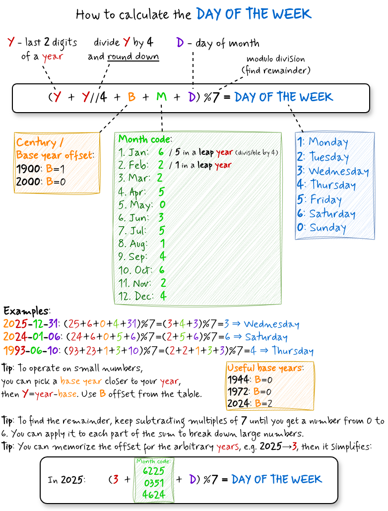

# How to Calculate the Day of the Week

[](../assets/misc/a-day-in-the-life.png)

Given any date, you can determine the day of the week in your head — no calendar needed.
This is a mental arithmetic trick based on **modular arithmetic**.
It feels a bit humiliating to being forced to reach for your phone every time someone mentions a date, being addicted to a phone in terms of every calendar question. This trick lets you answer on the spot, just using your mind.

## The math behind it
Mathematically, you just need to realize that the set of weekdays forms a **ring of residue classes modulo 7**.
Then, everything becomes obvious.
Days of the week repeat in a cycle of 7.
This is exactly what **modulo 7** captures - you only care about the remainder after dividing by 7.
Each day is just a number `0–6`, and arithmetic wraps around.
For simplicity, let's assume the intuitive mapping (In some languages Thursday and Friday are expressed as 4th and 5th day):  

* `1` - Monday,
* `2` - Tuesday,
* `3` - Wednesday,
* `4` - Thursday,
* `5` - Friday,
* `6` - Saturday,
* `0` - Sunday.

Each component of a date — year, century, month, day — contributes an **offset** to the total.
Sum them all up, take the remainder mod 7, and you get the weekday.

## The formula

```
(Y + Y//4 + B + M + D) % 7 = day of the week
```

Where:

- **`Y`** — last 2 digits of the year (e.g. `26` for 2026)
- **`Y//4`** — integer division of `Y` by 4 (round down), accounts for leap years
- **`B`** — century / base year offset (see table below, 0 for years 2000-2099)
- **`M`** — month code (see table below), including leap day
- **`D`** — day of the month

| Month | `M` (Month offset) |
|-------|------|
| Jan   | 6 (5 in leap year) |
| Feb   | 2 (1 in leap year) |
| Mar   | 2 |
| Apr   | 5 |
| May   | 0 |
| Jun   | 3 |
| Jul   | 5 |
| Aug   | 1 |
| Sep   | 4 |
| Oct   | 6 |
| Nov   | 2 |
| Dec   | 4 |

| Century | B |
|---------|---|
| 1900s   | 1 |
| 2000s   | 0 |
| 2100s   | 5 |

### Example
> 2025-12-31
> Y=25, Y//4 = 6
> December - M=4, leap day doesn't apply
> Y + Y//4 + M + D = 25 + 6 + 4 + 31 = 66 (mod 7) === 3 → Wednesday

## Why this works

Everything contributes to the final weekday: year number, a month, and a day number.
We need to sum up these individual contributions.

Each ordinary day shifts the weekday by 1. That's obvious.
Surprisignly, the same holds across years: each year shifts the calendar by exactly 1 day (`365 = 52×7 + 1`).
So if today is Friday, tomorrow is Saturday. But also, if today is Friday, next year will be Saturday (ignoring leap years for now).
It means that one year has the same effect as one day, and that's why you can just add the day number and year digits all together to get the total offset resulting from years and days.
That's the first trick.

Now, the impact of the month on the final weekday we can get from a lookup table, because that's too irregular to calculate in mind.
We calibrate the whole system (including months lookup table) in a way where a base year is 2000 and its offset is 0. That reduces the number of individual contributions to sum up.
Then we can just get last 2 digits of a year instead of a full year.

### Year offset `Y + Y//4`
Every 4 years there's a leap year adding one extra day.
`Y//4` accounts for the accumulated leap days.

### Why we subtract the leap day instead of adding
Using integer division `Y//4` is a clean, simple operation - no remainders, no fractions.
The trade-off is that it adds the leap day at the start of every 4th year, when it should only kick in after February.
For January and February of a leap year, the formula is therefore one day ahead of reality.

There are two ways to fix this: adjust those 2 months, or adjust the other 10.
We choose to pre-decrement the month codes for January and February by 1 in leap years (6→5, 2→1).
This has two advantages: we keep the simpler integer division, and only 2 months need special-casing instead of 10.

### Century offset `B` (century)
Since `Y` is just the last 2 digits of the year,
each century also shifts the base offset by a fixed amount.
To simplify calculations, we calibrate the month lookup table so that the year **2000** is the zero point.
With this anchoring, `B=0` for the entire 21st century, so you can ignore it entirely for any date from 2000 to 2099.

| Century | B |
|---------|---|
| 1900s   | 1 |
| 2000s   | 0 |
| 2100s   | 5 |

### Relative Base year
The calendar cycle repeats every 28 years (`7` starting days x `4` leap years cycle).
In general, you can treat `Y` as the difference between a target year and any base year, for which `B=0`.
This allows you to operate on smaller numbers, and get rid of `B` element in the formula.
Other useful base years with `B=0` are:

* **1916**,
* **1944**,
* **1972**,
* **2000**,
* **2028** .

It's handy if your date is farther from 2000.

Example:
> 26 April 1986
> 1986 is ahead of 1972 by 14 years, Y=14 (B=0)
> Y//4 = 3
> total year offset: Y + Y//4 = 17 (mod 7) === 3
> April - leap day doesn't apply (also 1986 is not divisible by 4)
> April - M=5
> D=26
> weekday: Y + Y//4 + M + D = 34 (mod 7) === 6 (SATURDAY)

## Month codes

| Month | Code |
|-------|------|
| Jan   | 6 (5 in leap year) |
| Feb   | 2 (1 in leap year) |
| Mar   | 2 |
| Apr   | 5 |
| May   | 0 |
| Jun   | 3 |
| Jul   | 5 |
| Aug   | 1 |
| Sep   | 4 |
| Oct   | 6 |
| Nov   | 2 |
| Dec   | 4 |

The sequence is: **6 2 2 5 0 3 5 1 4 6 2 4**

### Mnemonic: "genuinely smiled arch-winner"

To memorize this sequence, use the phrase **"genuinely smiled arch-winner"** in the
[Mnemonic Major System](mnemonic-major-system.md):

```
genuinely smiled  arch-winner
6 2 2  5  03 5 1   46    2  4
```


See the [Mnemonic Major System](mnemonic-major-system.md) article for how the encoding works.

## Examples

**2025-12-31:**
```
Y=25, Y//4=6, B=0, M=4 (Dec), D=31
(25 + 6 + 0 + 4 + 31) % 7 = 66 % 7 = 3 → Wednesday
```

**2024-01-06:**
```
Y=24, Y//4=6, B=0, M=5 (Jan in leap year 2024), D=6
(24 + 6 + 0 + 5 + 6) % 7 = 41 % 7 = 6 → Saturday
```

**1993-06-10:**
```
Y=93, Y//4=23, B=1, M=3 (Jun), D=10
(93 + 23 + 1 + 3 + 10) % 7 = 130 % 7 = 4 → Thursday
```

## Tips for mental calculation

### Modulo division
Modulo "division" is actually about subtracting.
To find the remainder, keep subtracting multiples of 7 until you get a number from O to 6.

Reduce early - apply mod 7 to each term as you go — no need to sum large numbers.
For example, `93 % 7 = 2`, `23 % 7 = 2`, then `(2+2+1+3+3) % 7 = 4`.

### Memorize the current year's offset
if you know that 2026 contributes `(26 + 6) % 7 = 4`,
then for any date in 2026 the formula simplifies to:

```
(4 + M + D) % 7
```

Keep it in your "cached" memory.

Ideally, memorize the total contribution of a current month of a year (`Y + Y//4 + M`), but then you need to invalidate the cache every month.

Quick lookup for the total year offset:  
* 2025 → 3
* 2026 → 4
* 2027 → 5
* 2028 → 0 (leap year)

### Use a nearby base year
If the date is far from 2000:
pick a known year with `B=0` (e.g. 1972), set `Y = year − base`, and use `B=0`.

Remember that the calendar cycle repeats every 28 years (`lcm(7, 4)`).
