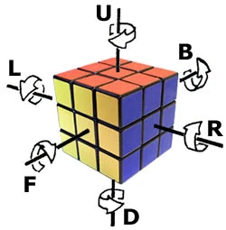

# Rubik's Cube Cheatsheet
## Move Notation



An apostrophe `'` (pronounced as prime) means to turn the face in the opposite direction (counterclockwise),
e.g. `L'`.

`U2` means to turn that face twice.

## Simple 3x3x3 Cube Algorithm
### 1. White Cross
Goal:  


Figure that on your own ☺️

### 2. White Corners
Goal:  


Pay attention to the matching colours on the sides.

### 3. Middle Layer
Now, Turn the cube upside-down. You need to fill the middle layer by moving edges from the top. Look for this pattern:

  
To move the top layer edge to the right, do this:
```
U R U' R' U' F' U F
```

### 4. Orient Yellow Cross
Look at the yellow pattern at the top. There are 3 cases.

#### Minus


To make the yellow cross, run:
```
FRU R'U'F
```
(mnemonic: "through roof")

#### L shape


Run "Minus" algo backwards, or run it multiple times.

#### Dot


Run "Minus" algo multiple times, until you get "Minus" pattern.

### 5. Permute Yellow Edges


```
R U2 R' U' R U' R'
U'
```
Mnemonic: R goes alternately. Run until white corner comes back.

### 6. Permute Last Layer


```
L' U R U' L U R' U'
```

### 7. Orient Last Layer


Repeat algo from step "5. Permute Yellow Edges" 2 times:
1 mirrored and 1 normal run:
```
L' U2 L U L' U L
R U2 R' U' R U' R'
```


## 4x4x4 Cube
### Edge Parity


```
# join left bottom with right top, breaks top edge
(dD) R U' R' (dD)'
# interlace left edge with right edge
(dD) R F' U R' F (dD)'
```

### OLL Parity


having bad edge at top, behind:
```
(rR) B2
(rR) U2 (rR) U2
(rR)' U2 (lL) U2
(rR)' U2 (rR) U2
(rR)' U2 (rR)' U2
```

### PLL Parity


Having bad edge top, front:
```
r2 U2 r2 (uU)2 r2 u2
```
