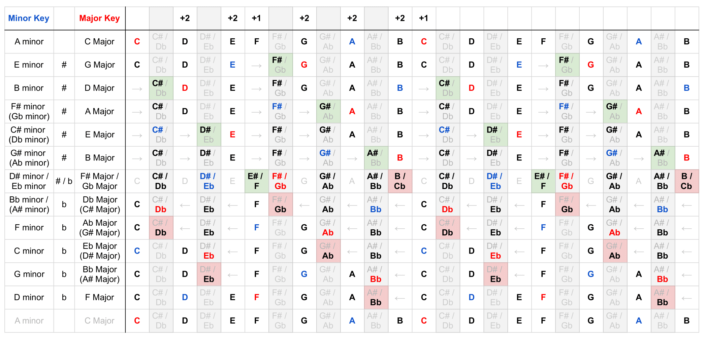
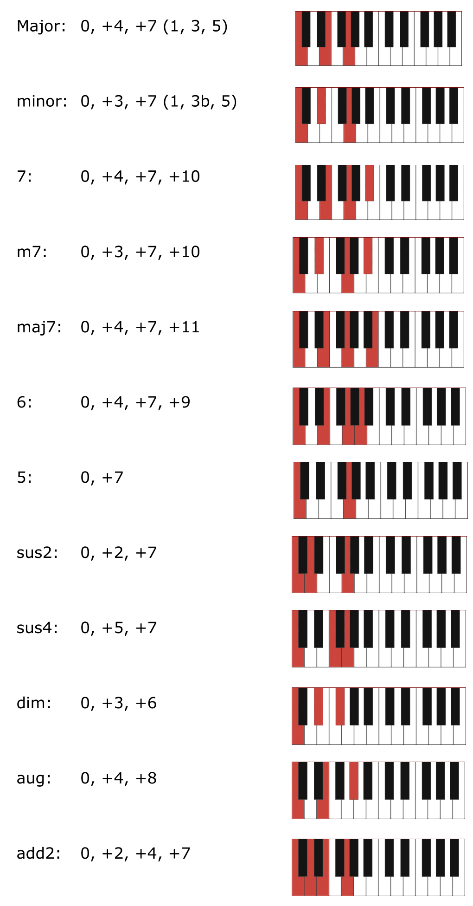

# Music Theory

## Diatonic Scales by Fifths

## Diatonic Scales in chromatic order

## Circle of Fifths

## Chord Types

## Diatonic scale degrees

1. **Tonic** (`I`)
2. *supertonic* (`ii`)
3. *mediant* (`iii`)
4. **Subdominant** (`IV`)
5. **Dominant** (`V`)
6. *submediant* (`vi`)
7. *subtonic* (`vii0`)

## Scale modes
Interval sequences:

1. **Ionian** (Major scale): `2-2-1-2-2-2-1`
2. Dorian: `2-1-2-2-2-1-2`
3. Phrygian: `1-2-2-2-1-2-2`
4. Lydian: `2-2-2-1-2-2-1`
5. Mixolydian: `2-2-1-2-2-1-2`
6. **Aeolian** (Natural minor scale): `2-1-2-2-1-2-2`
7. Locrian: `1-2-2-1-2-2-2`

## Staff Notes

